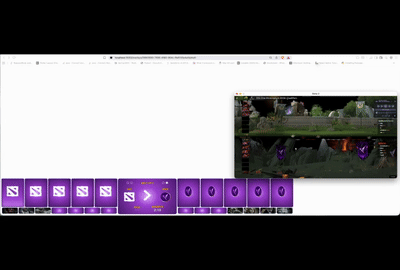
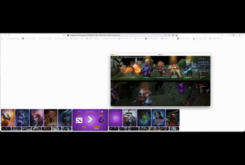
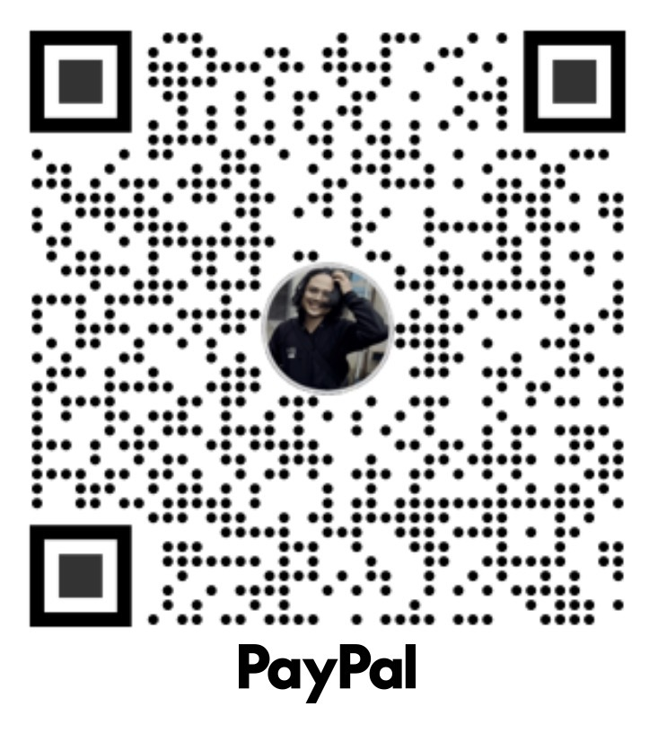
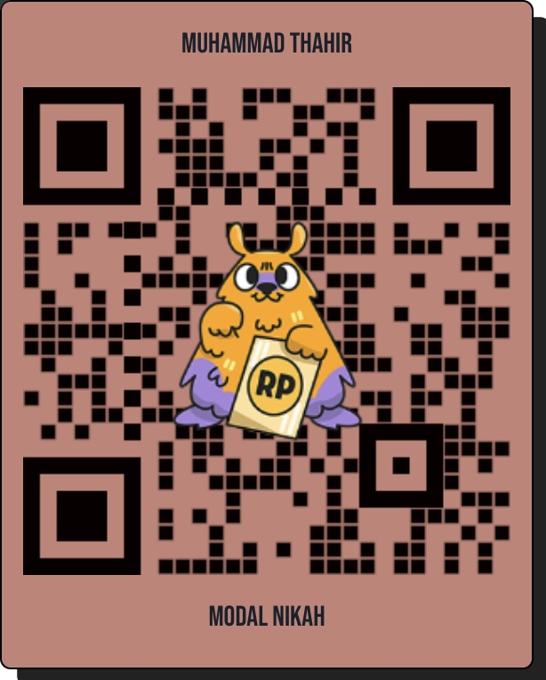

# DOTA 2 Overlay project
This project is a simple web application that can be use to be an overlay for OBS overlay. It is just a sample project of my own during my unemployment time and learning Javascript framewrok especially svelte which is new for me.

## Screenshot draft overlay


## sample hero showcase when team pick hero


## sample player name shown after draft finished



## Requirement

make sure you have already installed nodejs and postgresql, I don't want to explain on how to do it, get yourself to know. After that, clone this repository and install dependency using

```sh
npm install
```

after installing dependencies, setup the database connection in .env file as below. You can change to fit your database connection setting
```config
POSTGRE_HOST="your database server"
POSTGRE_PORT=port
POSTGRE_USERNAME="your postgre username"
POSTGRE_PASSWORD="your postgre password"
POSTGRE_DATABASE="dota_overlay"
ENCRYPTION_KEY="random hash key => 2b9UP262LhJVSTklqAsoIA=="
#the encryption key above is for encrypting password user
CORS_ORIGIN="http://localhost:3001"
BASE_URL="http://localhost:3000"
SOCKET_IO_URL="http://localhost:3000"
```
the random hash key above just a sample, you can generate it by your own

## Developing

Once you've setup database, start a development server:

```sh
npm run dev
```
and open your app in http://localhost:3000
## Building
This project using sequelize ORM for handling database
To create an automated table generation, run command:

```sh
npm run build
```

## Integrating to Dota 2 Client

### Create Gamestate integration Config file (.cfg)

create new text file. Make sure you have already have an user and login to app.
go to overlays, create new GSI token. after you create the token, just click   ``` Open configuration``` button and popup will show. Copy the script on the popup to text file and save the file inside the dota game directory with something like gamestate_integration_**[your custom id]**.cfg e.g **gamestate_integration_obs.cfg**.
You can see this [Youtube video](https://www.youtube.com/watch?v=7MTPiY7mB0c&t=12s) to save your config file

### Enable gamestate integration on dota client in steam

while opening steam client app, go to dota game, right click then choose properties, go to set launch options and add this command ```-gamestateintegration```.
You can read more detail about adding gamestate integration [here](https://support.overwolf.com/support/solutions/articles/9000212745-how-to-enable-game-state-integration-for-dota-2)

### Opening Overlay page on OBS

go to your overlays page and click one of your gsi clients (there is a hyperlink text). After you click that, you will go to overlay dashboard specific to that dota client. There are 3 tabs that you can control (currently only draft).
click the link on the draft to go to overlay page. copy and paste the link into your obs web viewer

### Check the data from Dota 2 client

Open your draft page. meanwhile go to dota client app and watch a live match/replay (I suggest to watch replay). you can check the overlay will show the teams, series and heroes picked/banned real time as gamesate integration from client send data to this project

### Control Action in Page 

#### Draft tab

You can play/pause the music on the draft page. change the title of the match, override the team name and scores by input the forms on the page. click save configuration to override gamestate


#### Ingame tab

This overlay would show player portrait based on player data you input in dota-config, roshan state and item timing when the match but this is automated (exclude roshan state) as player drew the first blood or buy specific items (e.g Black King bar or Daedalus). This feature is currenlty on development and not fully finished

#### Scoreboard tab

this tab is related to player score, net worth, experience KDA etc. This tab is on future roadmap


## Tech notes

### Socket IO 
This project using socket IO within the same server as HTTP. You can detach the socket IO server from the project and put it somewhere. As long as your client can access them. Also this is harcoded. You need to put it on environment variable. This file located in root folder named ```/socketio```. There are 2 files which is socket io handler configuration and injection to server svelte. As this is the same server, You must ensure the web server should be the same machine as Dota 2 client. (I dont have dedicated server yet)

### Screen resolution compatibility
This project only support for screen 1920x1080 (1080p) which might be a concern for a streamer who use higher resolution (e.g 4K). If you want to change the resolution, you need to edit the ``draft.css`` file on ``src/lib`` directory, there are ``screen-width`` and ``screen-height`` property set to 1080, just change it. But make sure the heropick/ban box not affected. (breaking layout is not warranted)


### Bad UI and Layout design

I acknowledge that I'm suck at design, I'm a back end programmer which prefer CLI or terminal like program. If you want to make the design better, just fork and give a try


### Hero Showcase Video
This project actually include Hero showcase video when the heroes being picked. But due to file size (and also my hardwork of editing video that cost me time and experience), I only push demo text. If you want to have full of exclusive hero showcase video just hit me up and don't forget to buy me [coffee](#buy-me-a-coffee) 😊☕️. 

## Project Resource and credits

this project actually inspired by some other repo which I will mention below, I'm just building on my own style based on their sharing. I would like to say thanks to them

- [Jeeo](https://github.com/jeoooo/dota-gsi-obs-overlay) 
- [xzion](https://github.com/xzion/dota2-gsi)
- [qqquiu](https://github.com/qqquiu/dota2-webdraft)
- [Open Dota API](https://www.opendota.com) for API guide (team names, players, items, heroes etc.)

# Buy me a Coffee 

## PayPal
I would appreciate you guys to help me this project by sending me a donation for my project. You can click this [link](https://www.paypal.me/MuhammadThahir739)  or scan my Paypal QR code below:




## Saweria (Indonesia)
For my fellow indonesian, you can send the donation by clicking this [link](https://saweria.co/mthahir) or you can scan QR code below:



# Keep connected
Follow my [instagram](https://www.instagram.com/mthahir_) if you want to stay connected 😎. 

# Thanks

